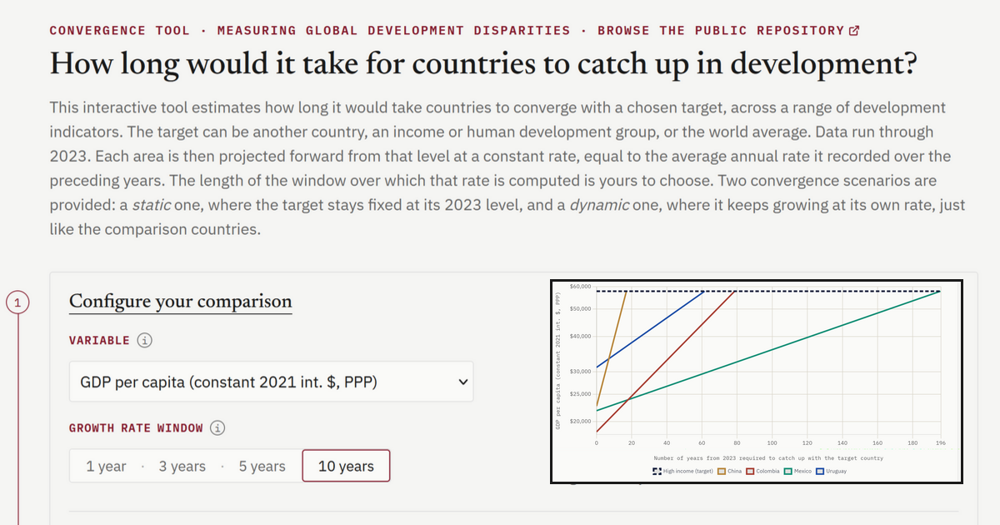

# Convergence tool

This repository contains the source code for an interactive tool that estimates how many years countries would need to catch up with a chosen development target, across a range of development indicators. The target can be another country, a World Bank income group, a UNDP human development group, or the world aggregate. 

This simple exercise aims to assess whether recent trajectories have been fast enough to close existing gaps and to make the scale of the remaining effort visible.

→ The website can be accessed at: https://yanisbkt-econ.github.io/convergence-tool/



## Method

Each country is projected forward from its base-year level (i.e., 2023) at a constant rate, equal to the average annual growth rate it recorded over the preceding *n* years. The number of years needed to close the gap, *t*, is found by setting the comparison country's projected level equal to the target's, then solving for *t*. This simple catch-up mechanism applies to two scenarios:

**Static scenario** where the target stays fixed at its base-year level:

$$t = \frac{\ln(L_T / L_c)}{\ln(1 + g_c)}$$

**Dynamic scenario** where the target keeps growing at its own rate:

$$t = \frac{\ln(L_T / L_c)}{\ln\left(\dfrac{1 + g_c}{1 + g_T}\right)}$$

where $L_c$ and $L_T$ correspond to the base-year levels of the comparison country *c* and of the target *T*, for whichever variable is selected. Meanwhile, $g_c$ and $g_T$ are their respective average annual growth rates, computed as geometric averages of annual log-differences over the selected window. If any year within the window is missing, the average growth rate for that window is itself reported as missing, rather than as a partial average.

| Symbol | Meaning |
|---|---|
| $L_c$, $L_T$ | Base-year levels of the comparison country *c* and of the target *T*. |
| $g_c$, $g_T$ | Average annual growth rates over the selected window of the comparison country *c* and of the target *T* |
| $t$ | Years needed to close the gap. Always rounded up. |

### Worked example using France and Uruguay's data

For a concrete illustration, let's consider the following case. 

> **Example.** Take Uruguay as the comparison country and France as the target, using GDP per capita with a 10-year growth window. Uruguay's 2023 level is $31,101, with an average annual growth rate of 1.0% over 2013–2023. France's 2023 level is $54,297, with an average annual growth rate of 0.8% over the same period. These historical growth rates are then held constant and projected forward from 2023. As such:
>
> **1** - *Static scenario* where France's level is held fixed at $54,297:
>
> $$t = \frac{\ln(54{,}297 / 31{,}101)}{\ln(1.01)} = \frac{0.557}{0.00995} \approx 56 \text{ years}$$
>
> **2** - *Dynamic scenario* where France also keeps growing at its own growth rate (i.e., 0.8% a year):
>
> $$t = \frac{\ln(54{,}297 / 31{,}101)}{\ln(1.01 / 1.008)} = \frac{0.557}{0.00198} \approx 281 \text{ years}$$
>
> Because France keeps growing in the dynamic scenario, Uruguay's relatively small growth advantage (1.0% against 0.8%) takes far longer to close the same gap.
>
> **Note:** Growth rates are rounded to one decimal here for readability. The tool itself uses full-precision rates internally, so figures shown in the interface may differ slightly from this simplified illustration.

### Results shown in the convergence tool

When *t* is defined, it is rounded up, since a partial year of catching up has not caught up. It then appears in green in the convergence tool. However, three other cases are reported in words rather than as a number when the following conditions are met:

| Case | Condition | Shown as |
|---|---|---|
| Already ahead | $L_c \geq L_T$ | `already ahead` |
| Never converges | $g_c \leq 0$ (static), or $g_c \leq g_T$ (dynamic) | `never` |
| Missing rate | The source does not cover the selected window | `no data` |

Note that income groups, human development groups and the world aggregate are read directly from the source files. Nothing is recomputed by myself. Each provider publishes its own aggregate for the group, based on its own membership list and its own weighting. The tool reads that published value as it stands, then treats it exactly like any other area: same base year, same growth rate windows, same equations.

## Data and replication

The sources and indicators are listed below. Data are restricted to 2023, the most recent year common to every source. This ensures every projection starts from the same base-year level and is comparable across countries.

| Source | Indicators | Link |
|---|---|---|
| World Bank, World Development Indicators | GDP per capita (constant 2021 int. $, PPP) | [data.worldbank.org](https://data.worldbank.org/indicator/NY.GDP.PCAP.PP.KD) |
| UNDP, Human Development Report 2025 | GNI per capita<br>Life expectancy at birth<br>Expected years of schooling<br>Mean years of schooling<br>HDI<br>Inequality-adjusted HDI (IHDI)<br>Gender Inequality Index (GII, inverted) | [hdr.undp.org](https://hdr.undp.org/data-center/documentation-and-downloads) |
| UNSD, M49 Standard | Country name harmonisation | [unstats.un.org](https://unstats.un.org/unsd/methodology/m49/) |

Databases are processed in Stata, following the same pipeline for every indicator: raw values are cleaned and reshaped, area names are harmonized, and two files are exported per indicator. The first file corresponds to the full observed time series (used for the historical raw-data view). The second file contains the base-year level (i.e., 2023) and average annual growth rates over each window (used by the tool itself). These averages are computed over 1-, 3-, 5-, and 10-year windows.

As already stated above, growth rates are computed as geometric averages of log-differences over the selected window. Any window containing a missing observation is returned as missing rather than as a partial average. The HTML file never recomputes a rate; it only reads what the pipeline exported and proceeds to the equation above. For transparency, here is the relevant function from `index.html`:

```javascript
function tStatic(a, b){
  if (a.value >= b.value) return 0;
  const g = a.g[state.n];
  if (g === null || g === undefined || isNaN(g)) return undefined;
  const t = Math.log(b.value / a.value) / Math.log(1 + g);
  if (t <= 0 || !isFinite(t)) return null;
  return t;
}

function tDynamic(a, b){
  if (a.value >= b.value) return 0;
  const ga = a.g[state.n], gb = b.g[state.n];
  if ([ga,gb].some(v => v === null || v === undefined || isNaN(v))) return undefined;
  const ratio = (1 + ga) / (1 + gb);
  if (ratio <= 1) return null;
  const t = Math.log(b.value / a.value) / Math.log(ratio);
  if (t <= 0 || !isFinite(t)) return null;
  return t;
}
```
The raw downloads, the Stata do-files (including the master file used to run the full pipeline), and the exported datasets read by the tool are all included in the repository. Anyone willing to download the repository can thus replicate the dataset and run the convergence tool locally.

## Repository layout

The layout of the repository follows this structure:

*   `Raw/`: Contains raw World Bank and UNDP downloads, along with the UNSD M49 standard.
*   `Prog/`: Stata do-files that build the `Data/` files from `Raw/`, including the master file used to run the full pipeline. The project root path must be updated at the top of the master file before running it.
*   `Data/`
    *   `Convergence_tool/`: One CSV file per indicator, each with one row per area, containing basic metadata, the base-year level (i.e., value of the indicator in 2023), and one average annual growth rate column per window (i.e., 1, 3, 5 and 10).
    *   `Time_series/`: One CSV file per indicator, in long (panel) format, containing basic metadata and the observed level for every year (up to 2023).
*   `Assets/`: Contains the favicon and preview image used for link previews.
*   `index.html`: Builds the entire website (markup, styles, and logic) and computes the two equations.
*   `LICENSE`: MIT license for the code.
## Running locally

1. Clone the repository and move into it:

```bash
git clone https://github.com/yanisbkt-econ/convergence-tool.git
cd convergence-tool
```

2. Start a local server from the repository root:

```bash
python -m http.server 8000
```

3. Open `http://localhost:8000` in a browser.

## License

Code released under the MIT License (see `LICENSE`). Data files are derived from World Bank and UNDP releases and remain subject to the terms of their original providers.
